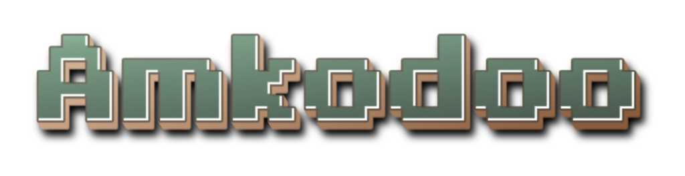
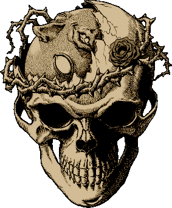

  

## ⚡️ A Few Quick **Facts**

- 🚀 Currently working as a Cloud & Data Engineer
- 🔗 I love connecting IoT systems and solving interoperability challenges
- 📊 Building small Streamlit apps for data visualization and analytics
- 🐍 Exploring Python automation and algorithmic problem solving
- 🛠️ Into DIY electronics and small-scale robotics projects
- 🎨 Enjoy designing & 3D printing parts that merge with electronics
- 🌱 Learning frontend development to close the full-stack loop
- 🧠 Passionate about self-education, open-source, and experimentation
- 🎓 Hold a Bachelor’s degree in Mechatronics Engineering

---

## 🖥️ My Dev Setup

 
 

---

## ⚙️ Tech & Tools I use

---
